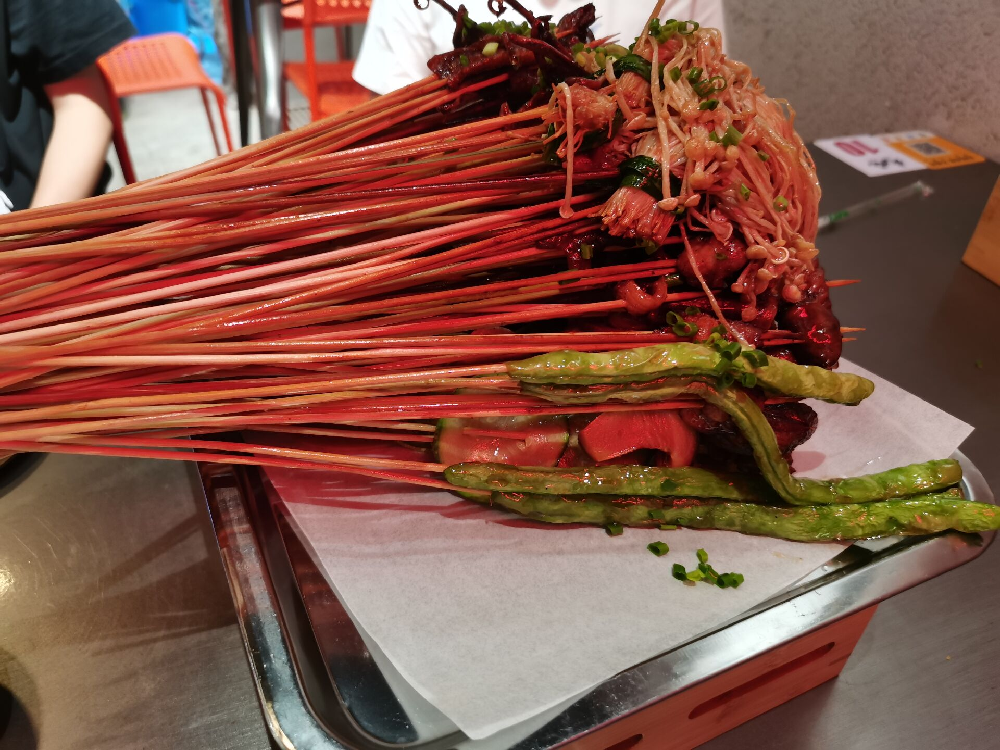
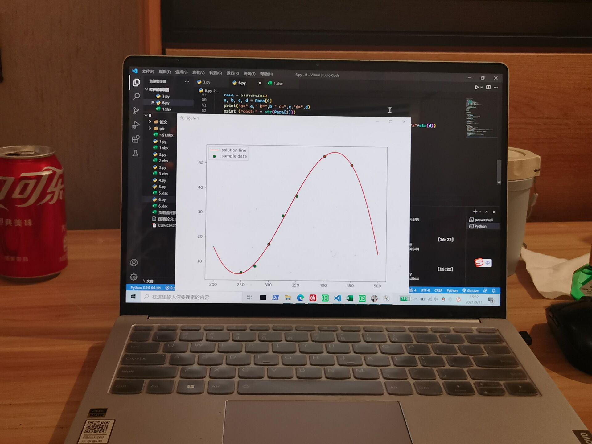
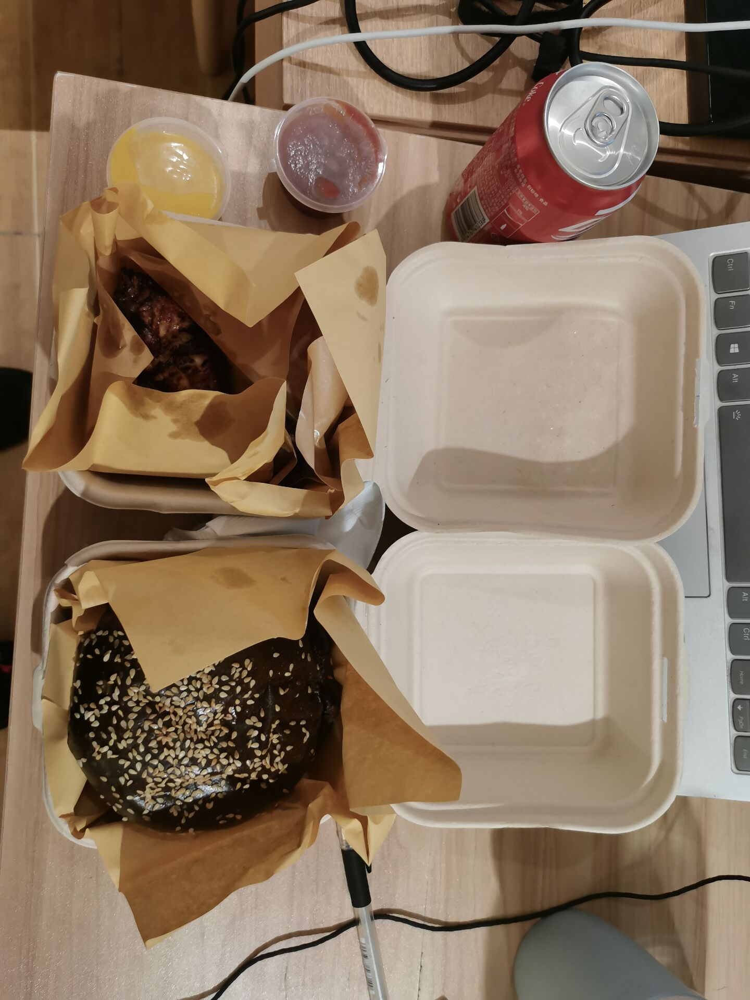
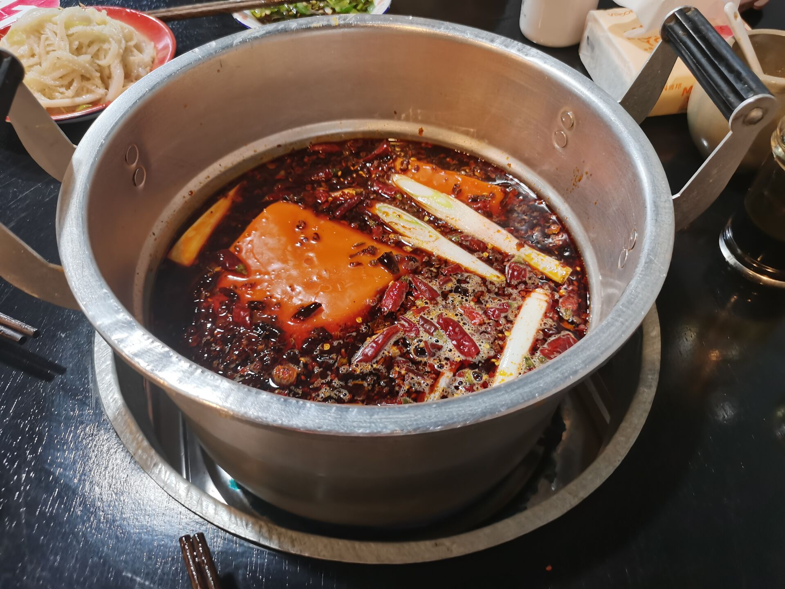
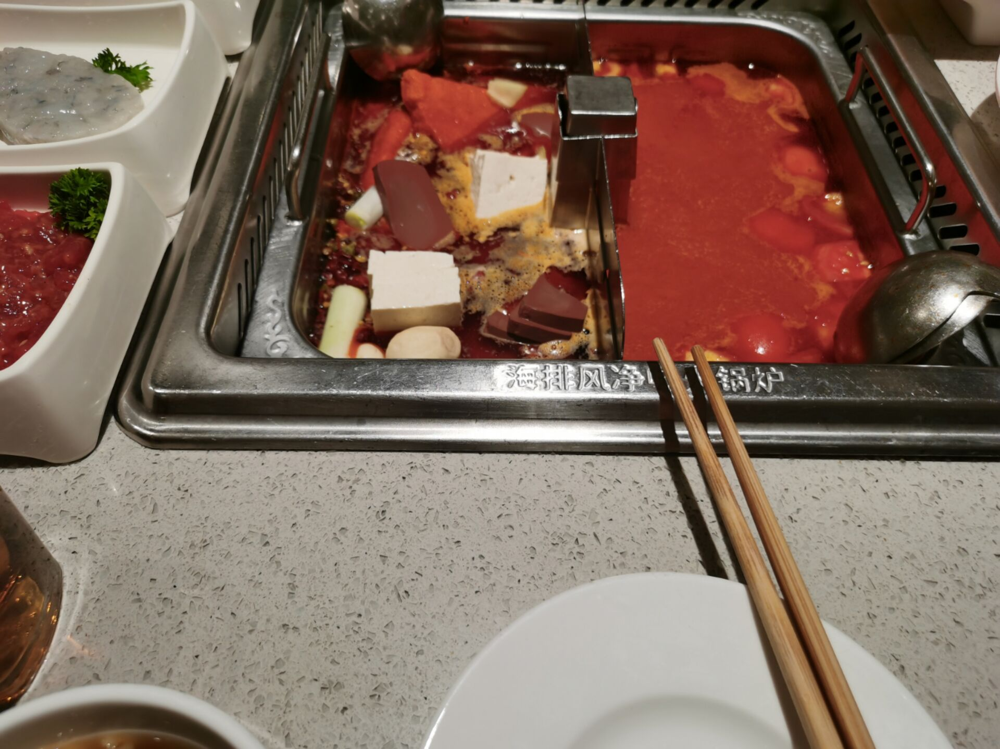

## 纪念21年9月~~（摸鱼的)~~国赛

从10号开始，到12号结束，为期3天的国赛也算是慢慢落下了帷幕。现在是北京时间的9月12日凌晨1点39分，我和我俩队友躺在宾馆床上，我在摸鱼写着这个文章，而队友正在认真的使用latex写着论文，最基本的建模工作和代码编写工作已经完成，就剩下编写最后的论文了。

先介绍一下我们的团队吧，我的队友是林学长和马学姐（啊啊啊情侣超甜的，单身狗的我酸爆，啊啊啊也想恋爱了呢），林学长和马学姐是金融工程专业的大三学生（阿西，我也大二了），他俩不仅是一对超甜的神仙情侣，还是一对学霸，妥妥年级前十（我的绩点拉低了平均水平orz）。而我，计算机大二混子，啥也不会，全靠现学现卖的摸鱼学专家。

### 21.9.9

晚上8点，我还在和好友聊天时，国赛的题目发布。在送好友回寝后，便匆匆赶回寝室阅读“语文题”。这也是数学建模的第一个步骤，阅读题目。简单概括一下题目，A题是有关于FAST中国天眼的建模，大致上需要极强的物理功底，我俩队友选择放弃，B题是有关于乙醇转化题，也需要化学功底，放弃，C题数据量太大，对于我这种编程菜鸡而言没学啥太多的算法，所以也选择放弃。所以我问了一个很蠢的问题，就是能不能选DE题（误），然后就被学长学姐骂了（tips ：DE题好像是给专科大学生做的，请看者不要再问这个问题了）。于是再回头去看，A题学长的建模功底不行，而C题我的编程能力不行，于是只能选择B题了。当选完题目后，因为不在一起，只能选择查找资料，而对于一个并不常用知网的我在找遍国内国外中文英文的论文后，只能找到一篇较为专业的论文（埋下伏笔），后面就草草睡觉了，准备第二天的早八。啊啊啊啊，建模时还是卑微早八人。

### 21.9.10

早上8点，我开始了摸鱼数学课，随后发现好多同学为了建模而翘课，内心不免滋生翘课意识，于是第二节大物课就选择翘了，兴冲冲赶到望江校区摸鱼开始建模比赛。顺便提一句，望江旁边的一只酸奶牛奶茶店真的不好喝，白白骗我13元，就是普通酸奶么。而当我匆匆赶到速八酒店时，学长他们已经开始寻找资料了~~（我是废物）~~。当然，随着对于题目的资料探索，我们首先开始分工，我首先负责了使用Python的绘图工作，其中主要是使用matplotlib库进行绘图，（麻了，建模前一天才知道不能使用matlab，我裂开了！！），于是现学现卖写了几个关于折线图的绘制函数，终于也解决了绘图的问题。然而，当我完成了从零开始学绘图的绘图工作后，学长还在对建模一筹莫展，学姐还在码字写latex。所以，我只能提出了三种假说，第一种是实现对温度的二次函数拟合，因为温度肯定在最佳温度时达到最大值，于是说干就干，直接上手使用numpy进行一系列暴力拟合，然后前面的系数肯定与各种催化剂关系有关，然而当我们跑完后我们才意识到了数据量太少了，根本不够多次拟合，只能放弃（这时已经是晚上11点了）

晚饭是KFC，那天刚好30块上校鸡块打折，他们吃的是炸串，，有一说一除了有点油，炸串还是蛮好吃的呢

### 21.9.11

9.11凌晨，继续肝论文，第一个模型因为建模数据太少不甘放弃。于是就想到第二个模型，也就是多元多次函数拟合，然鹅看完Python的编写内容，以及一些奇奇怪怪神经网络算法，我直接开裂（学长还问我能不能用神经网络，我这菜鸡还配用么？）而且学长学姐连最基本的Python也不会，只能靠本菜鸡柔弱编程，顺带便还得解决一些计算机相关软件的问题（*甚至还帮学长安装了vscode配置了Python和cpp环境*）由于编程难度太大，我无奈放弃，下次建模前我一定好好学！！！而第三个建模因为在浓度为零的情况下转化率肯定为0，所以应该为类似于

$ \left( \alpha T^2+\beta T+\varepsilon \right) \times \left( \delta C \right) \times \left( 1/R \right) $的函数，其中T为温度，C为浓度，R为HAP的质量，然鹅，因为在观赏数据后发现这转化率并不随C的增加而增加，所以无奈只能放弃。最后想把函数改为$ \left( \alpha T^2+\beta T+\varepsilon \right) \times \left( \delta C^2+\mu C \right) \times \left( 1/R \right) $的函数，后面也发现数据量不足。

所以，遇到困难睡大觉！睡觉！

9.11早上8点，麻了，一事无成（真摸鱼，看b站，甚至想嫖答案）

9.11中午，宝炙星汉堡，yyds，但被不止一个人说过喜欢吃美式快餐，我觉得美式快餐是快速方便还好吃的不二选择，如果没啥选择就吃这个，感觉这个汉堡比上次吃的本垒汉堡还好吃。

9.11下午，在阅读完国奖论文后，经商讨决定选择去通过计量统计的方法进行预测，经过了数十轮的数据预测，终于得到了一个可以解释70%数据的函数（中间省略了数千困难）反正大喜过望，准备完成第三题的建模回答，然鹅我发现除了拉格朗日乘数法会求解最大值，其余什么蚁群算法，模拟退火算法，我都**不会**。所以，遇到困难去吃饭。

9.11晚饭，马路边边麻辣烫，真的好吃，就是天天吃火锅感觉没什么意思，成都不是烤肉烤鱼这种烤物，就是麻辣烫火锅串串钵钵鸡这种类似于火锅的食物，这才是美食荒漠！~~（不接受反驳）！~~

9.11晚上，突然意识到可以使用枚举法慢慢跑，于是决定选择枚举法用CPP跑上亿个数据（大概4亿吧），然鹅最绝望的事情出现了，发现绝大多数转化率全都是负数！转化率怎么可能是负数呢？！于是开始调整函数，通过建模时学到的将一些变量取ln()即可，甚至跑出拟合超过90%的数据量！！**大喜过望**，可惜人生就是起起落落，跑出来发现最高转化率居然超过了百分百，只能被迫修改参数，将函数放在了一个较为准确的范围，也就是伏笔里最优答案（笑）。就在这起起落落中结束了第二天，其实真正建模也就半天（请各位建模兄弟也不要放弃啊，我另外一个hxd最后一天才开始写）

### 21.9.12

攻克最后一题，也就是如何增加实验组数，这种论述题目也就摸鱼慢慢鬼扯，于是我们就选择写了温度之间的关系（**当然也是参考那个论文咯**）于是就快乐结束了为期3天的建模之旅。

下午学长学姐在用latex写论文，而我在狂补概统和离散的作业，枯了。

下午＋晚上 和朋友去吃海底捞，看电影，逛街，喝奶茶，以及看她剪爆炸的头发。有一说一，失控玩家好看的，就是有点困了，差点睡着。穷孩子第一次吃海底捞，但服务是真的超棒！吹爆！

**这，就是菜鸡的21年数学建模吧，希望能拿个好的奖项，明年也会好好努力再战的**

### 总结

当然在数学建模中也获得了一些经验：

1. 比如最好3个人住在一起，
2. 比如最好不要和情侣一起，电灯泡3天真的顶不住，
3. 比如最好找会编程会写论文会建模的全才，不然一个人编程超累
4. 比如不应该在最后一刻放弃，转机总有的

最后，希望明年加油吧，也谢谢他们的照顾，也祝学长学姐99，以后江湖梦远，后会有期。

也祝我们能取得一个较好的名次吧！

~另：最近博客可能比较草率，请大家见谅，最近在大改博客，这个博客未来可能会弃用，谢谢大家支持~

